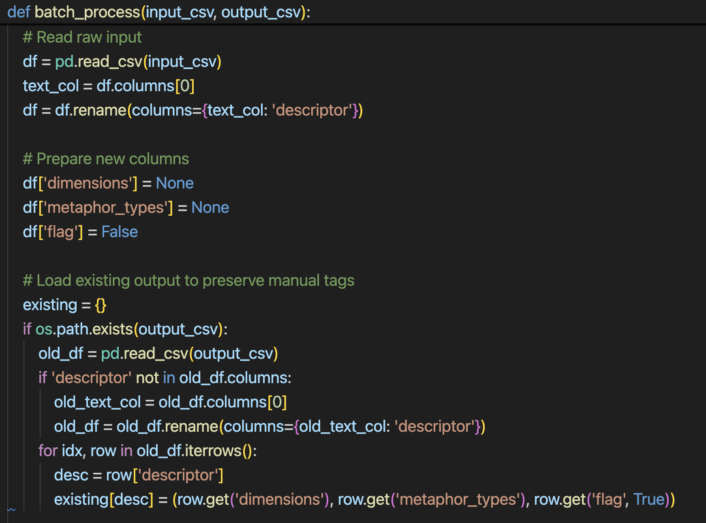

# 🧠 How I Built the Pain Descriptor Auto-Tagger  
*(English below – Español más abajo)*

---

## 📍 Why This Project?

As a linguistics PhD with extensive research and published work in health communication (https://orcid.org/0000-0002-7402-0819), I’ve spent years studying how people describe pain — especially when conventional medical language falls short. Expressions like *"a balloon swelling up inside me"* or *"claws around my womb"* aren't just poetic — they're diagnostic, emotional, and deeply human.

I wanted to build a tool that would bridge my academic expertise with my new technical skill set in Python and NLP. The result is the **Pain Descriptor Auto-Tagger**: a Python-based tool that automatically tags metaphor-rich pain descriptors with both experiential and metaphorical dimensions.

---

## 🔬 The Linguistic Theory Behind It

Pain language is rarely literal. It's:

- **Experiential** — grounded in sensory, affective, or temporal dimensions  
- **Metaphorical** — using conceptual frames like *pressure*, *violence*, or *heat*

I designed a custom taxonomy that reflects this dual-layered structure — something I refer to as:

> “Descriptors that are multi-layered — capturing both experiential (sensory/affective) and figurative (metaphorical/submetaphorical) dimensions.”

---

## 🛠️ How It Works

The tool consists of a modular Python pipeline:

- `pain_tags_input.csv`: raw pain descriptors
- `pain_descriptor_auto_tagger.py`: applies keyword and taxonomy-based tagging
- `taxonomy.json`: defines metaphor types and experiential categories
- `visualize_tags.py`: generates tag frequency charts

The output is a tagged CSV with:

- Metaphor type(s)
- Experiential dimension(s)
- Intensity/salience (if applicable)

---

## 🖼️ Visual Examples

**Tagger Script:**  

**Auto-tagged Output:**  

**Tag Distribution:**  

---

## 💡 Challenges & Learnings

- Creating flexible rules for tagging metaphor without losing nuance
- Structuring code to support scalability and post-processing
- Translating abstract linguistic concepts into applied tagging logic
- Learning to visualize insights clearly with code

This was more than a coding challenge — it was a way to bring deep subject knowledge into a new career direction.

---

## 🚀 What’s Next?

- Add a basic web interface for manual verification  
- Try LLM-powered metaphor detection  
- Apply the same framework to domains like motherhood, fatigue, or mental health

---

## 🙋‍♀️ About Me

I’m Stella — a junior Python and front-end developer with 20+ years in linguistics, now building tech that’s informed by theory, empathy, and human experience.

📎 [See the project on GitHub](https://github.com/stellabullo/pain-descriptor-auto-tagger)  
🤝 [Connect on LinkedIn](https://www.linkedin.com/in/stella-bullo-905b17230/)

---

---

# 🧠 Cómo construí el Pain Descriptor Auto-Tagger

---

## 📍 ¿Por qué este proyecto?

Como doctorada lingüista con experiencia en trabajo de campo y publicaciones en comunicación en salud (https://orcid.org/0000-0002-7402-0819), he pasado años estudiando cómo las personas describen el dolor — especialmente cuando el lenguaje médico no alcanza. Expresiones como *"un globo que se infla dentro mío"* o *"garras alrededor del útero"* no son solo metáforas: son diagnósticos emocionales, sensoriales y profundamente humanos.

Quise construir una herramienta que uniera mi experiencia académica con mis nuevas habilidades técnicas en Python y PLN. Así nació el **Pain Descriptor Auto-Tagger**: una herramienta en Python que etiqueta automáticamente descripciones del dolor con dimensiones tanto experienciales como metafóricas.

---

## 🔬 La base lingüística

El lenguaje del dolor raramente es literal. Es:

- **Experiencial** — sensorial, afectivo o temporal  
- **Metafórico** — utiliza marcos conceptuales como *presión*, *violencia*, o *calor*

Diseñé una taxonomía propia que refleja esta estructura doble — lo que describo como:

> “Descriptores que son multilaminares — que capturan dimensiones experienciales (sensoriales/afectivas) y figurativas (metafóricas/submetafóricas).”

---

## 🛠️ Cómo funciona

El proyecto consiste en un pipeline modular en Python:

- `pain_tags_input.csv`: descripciones sin procesar  
- `pain_descriptor_auto_tagger.py`: aplica reglas y taxonomía  
- `taxonomy.json`: define tipos de metáfora y dimensiones  
- `visualize_tags.py`: genera gráficos de distribución

El resultado es un `.csv` con:

- Tipo(s) de metáfora  
- Dimensión(es) experiencial(es)  
- Intensidad/saliencia (si corresponde)

---

## 🖼️ Ejemplos visuales

**Script del etiquetador:**  

**Salida con etiquetas automáticas:**  

**Distribución de etiquetas:**  

---

## 💡 Desafíos y aprendizajes

- Diseñar reglas flexibles sin perder la complejidad del lenguaje  
- Organizar el código para que sea escalable  
- Traducir teoría en funciones prácticas  
- Aprender a visualizar patrones útiles para el análisis lingüístico

Más que un reto técnico, fue una forma de fusionar mi experiencia profesional con una nueva etapa profesional.

---

## 🚀 Próximos pasos

- Agregar una interfaz web para revisión manual  
- Probar detección automática con LLMs  
- Aplicar el marco a otros temas: maternidad, salud mental, dolor crónico

---

## 🙋‍♀️ Sobre mí

Soy Stella — desarrolladora junior en Python y front-end, con 20 años de experiencia en lingüística. Estoy construyendo herramientas donde el lenguaje, la empatía y el código se unen.

📎 [Ver el proyecto en GitHub](https://github.com/stellabullo/pain-descriptor-auto-tagger)  
🤝 [Conectá conmigo en LinkedIn](https://www.linkedin.com/in/stella-bullo-905b17230/)

---

