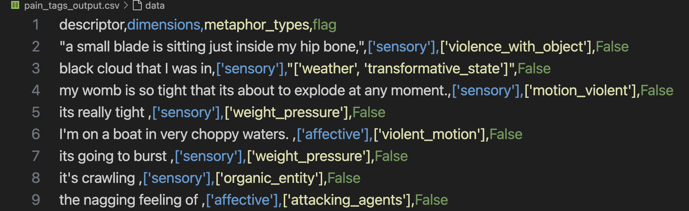
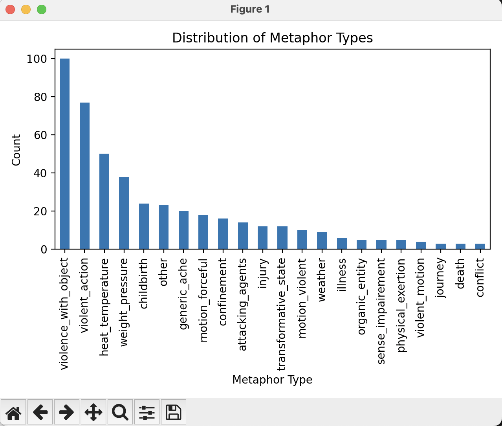

# Pain Descriptor Auto-Tagger

> A lightweight Python/NLTK pipeline for tagging pain metaphors  
> with three linguistic dimensions (sensory, affective, temporal)  
> and a rich set of metaphor types — built by a linguist, powered by mates 🧉.

---

## 📂 Repository Structure

```text
pain-descriptor-tool/
├── pain_descriptor_auto_tagger.py
├── pain_tags_input.csv
├── pain_tags_output.csv
├── export_flagged.py
├── merge_manual.py
├── remove_metaphorical.py
├── remove_flag_column.py
├── visualize_tags.py
├── taxonomy.json
├── requirements.txt
├── README.md
└── screenshots/
    ├── input_example.png
    ├── output_example.png
    └── tag_distribution.png


```

- **`taxonomy.json`** – your full list of dimensions, metaphor types, and keywords  
- **`pain_descriptor_auto_tagger.py`** – batch + CLI review auto-tagger  
- **`export_flagged.py`** – extract “needs manual review” descriptors  
- **`merge_manual.py`** – merge your spreadsheet edits back in  
- **`remove_metaphorical.py`** – strip the now-redundant “metaphorical” dimension  
- **`remove_flag_column.py`** – drop the internal `flag` column for publishing  
- **`visualize_tags.py`** – bar-chart distributions of final tags  

---

## 🚀 Quick Start

1. **Clone & set up**  
   ```bash
   git clone <your-repo-url>
   cd pain-descriptor-tool
   python3 -m venv venv && source venv/bin/activate
   pip install -r requirements.txt
   python -c "import nltk; nltk.download('punkt')"
   ```

2. **Auto-tag your CSV**  
   ```bash
   python pain_descriptor_auto_tagger.py \
     --batch \
     --input pain_tags_input.csv \
     --output pain_tags_output.csv
   ```

3. **Review & fix any flags**  
   ```bash
   python pain_descriptor_auto_tagger.py --review --output pain_tags_output.csv
   ```

4. **Export remaining flags for spreadsheet**  
   ```bash
   python export_flagged.py
   # → opens flagged_descriptors.csv
   # Fill in `dimensions,metaphor_types` columns, save file.
   ```

5. **Merge your manual edits**  
   ```bash
   python merge_manual.py
   ```

6. **Cleanup for publication**  
   ```bash
   python remove_metaphorical.py
   python remove_flag_column.py
   ```

7. **Visualize tag distributions** *(optional)*  
   ```bash
   python visualize_tags.py
   ```

---

## 🔍 What It Does

- **Dimensions**: tags each descriptor as one (or more) of  
  `sensory`, `affective`, `temporal`.  
- **Metaphor types**: classifies into categories such as  
  `violent_action`, `weight_pressure`, `generic_ache`, `journey`, etc.  
- **Manual review workflow**: flags unmatched items, groups similar entries,  
  then lets you batch-correct via interactive CLI or spreadsheet merge.

---

---

## 🖼️ Example Workflow

This is how the tool processes raw pain descriptors and tags them using metaphor-aware linguistic logic.

### 🔹 Input: Raw Descriptors
These are metaphor-rich expressions drawn from real patient narratives.


---

### 🔹 Output: Auto-tagged Results
Each descriptor is automatically labeled with:
- **Dimension(s)** — experiential framing: `sensory`, `affective`, or `temporal`
- **Metaphor Type(s)** — grounded in a custom taxonomy of metaphorical pain frames



---

### 🧾 Example Table

| Descriptor                          | Dimensions         | Metaphor Types           |
|-------------------------------------|---------------------|---------------------------|
| a balloon swelling up inside you    | sensory             | pressure_expansion        |
| I've been run over                  | affective, sensory  | violent_action            |
| scraping metal against metal        | sensory             | machine_harshness         |

---

### 📊 Tag Distribution Overview
This chart shows the frequency of different metaphor types across the corpus.

*Generated using `visualize_tags.py`*



---

## 🤝 Why It Matters

Pain language is inherently metaphorical. By systematizing how we tag those metaphors, this tool:

- **Bridges theory & practice** in conceptual metaphor research  
- **Demonstrates** core NLP/linguistic skills: tokenization, stemming, rule-based classification  
- **Showcases** a clean Python CLI + manual review + visualization pipeline  
- **Serves** as a neat portfolio project for Python + linguistics roles

---

## 🛠️ Customization

- Edit **`taxonomy.json`** to add/remove dimensions or metaphor types.  
- Tweak keyword lists to refine auto-tag coverage.

---

## 👤 Author

Stella Bullo — PhD in Linguistics, health communication researcher, and self-taught Python/NLP enthusiast.  

Metaphors, mates, and methodology — all in one brew! 🍵🚀


-------

# Etiquetador Automático de Descriptores de Dolor

> Una canalización ligera de Python/NLTK para etiquetar metáforas de dolor  
> con tres dimensiones lingüísticas (sensorial, afectiva, temporal)  
> y una rica variedad de tipos de metáforas — creada por una lingüista, impulsada por mates 🧉.

---

## 📂 Estructura del Repositorio

```text
pain-descriptor-tool/
├── README.md
├── requirements.txt
├── taxonomy.json
├── pain_descriptor_auto_tagger.py
├── export_flagged.py
├── merge_manual.py
├── remove_metaphorical.py
├── remove_flag_column.py
├── visualize_tags.py      # script opcional para gráficos
├── pain_tags_input.csv
└── pain_tags_output.csv
```

- **`taxonomy.json`** – lista completa de dimensiones, tipos de metáforas y palabras clave  
- **`pain_descriptor_auto_tagger.py`** – etiquetador automático con fases por lotes y revisión CLI  
- **`export_flagged.py`** – extrae descriptores pendientes de revisión manual  
- **`merge_manual.py`** – fusiona tus ediciones de la hoja de cálculo de vuelta al CSV principal  
- **`remove_metaphorical.py`** – elimina la dimensión ahora redundante “metafórica”  
- **`remove_flag_column.py`** – elimina la columna interna `flag` para publicación  
- **`visualize_tags.py`** – genera gráficos de barras de las etiquetas finales  

---

## 🚀 Inicio Rápido

1. **Clona e instala**  
   ```bash
   git clone <tu-url-del-repo>
   cd pain-descriptor-tool
   python3 -m venv venv && source venv/bin/activate
   pip install -r requirements.txt
   python -c "import nltk; nltk.download('punkt')"
   ```

2. **Etiqueta tu CSV**  
   ```bash
   python pain_descriptor_auto_tagger.py \
     --batch \
     --input pain_tags_input.csv \
     --output pain_tags_output.csv
   ```

3. **Revisa y corrige**  
   ```bash
   python pain_descriptor_auto_tagger.py --review --output pain_tags_output.csv
   ```

4. **Exporta lo pendiente**  
   ```bash
   python export_flagged.py
   # → abre flagged_descriptors.csv
   # Completa `dimensions,metaphor_types` en el CSV y guarda.
   ```

5. **Fusiona tus ediciones**  
   ```bash
   python merge_manual.py
   ```

6. **Limpia para publicación**  
   ```bash
   python remove_metaphorical.py
   python remove_flag_column.py
   ```

7. **Visualiza las distribuciones** *(opcional)*  
   ```bash
   python visualize_tags.py
   ```

---

## 🔍 Qué Hace

- **Dimensiones**: asigna cada descriptor a una o más de  
  `sensorial`, `afectiva`, `temporal`.  
- **Tipos de metáforas**: clasifica en categorías como  
  `violent_action`, `weight_pressure`, `generic_ache`, `journey`, etc.  
- **Revisión manual**: marca los no detectados, agrupa similares,  
  y permite corregir vía CLI interactiva o fusión de hoja de cálculo.

---

---

## 🖼️ Ejemplo del Flujo de Trabajo

Así es como la herramienta procesa los descriptores de dolor y los etiqueta utilizando lógica lingüística basada en metáforas.

### 🔹 Entrada: Descriptores sin procesar
Estas son expresiones ricas en metáforas tomadas de narrativas reales de pacientes.


---

### 🔹 Salida: Descriptores etiquetados automáticamente
Cada descriptor se etiqueta automáticamente con:
- **Dimensiones** — marco experiencial: `sensorial`, `afectiva` o `temporal`
- **Tipos de metáforas** — basados en una taxonomía propia de marcos metafóricos del dolor


---

### 🧾 Tabla de ejemplo

| Descriptor                          | Dimensiones         | Tipos de metáforas        |
|-------------------------------------|----------------------|----------------------------|
| a balloon swelling up inside you    | sensorial            | pressure_expansion         |
| I've been run over                  | afectiva, sensorial  | violent_action             |
| scraping metal against metal        | sensorial            | machine_harshness          |

---

### 📊 Distribución de etiquetas
Este gráfico muestra la frecuencia de los diferentes tipos de metáforas en el corpus.

*Generado con `visualize_tags.py`*


---

## 🤝 Por Qué Importa

El lenguaje del dolor es inherentemente metafórico. Al sistematizar su etiquetado, esta herramienta:

- **Conecta teoría y práctica** en investigación de metáforas conceptuales  
- **Demuestra** habilidades esenciales de NLP/lingüística: tokenización, lematización, clasificación por reglas  
- **Muestra** un pipeline limpio: CLI en Python + revisión manual + visualización  
- **Sirve** como proyecto de portafolio para roles de Python + lingüística

---

## 🛠️ Personalización

- Edita **`taxonomy.json`** para añadir o quitar dimensiones o tipos de metáforas.  
- Ajusta las listas de palabras clave para mejorar la cobertura automática.

---

## 👤 Autora

Stella Bullo — Doctora en Lingüística, investigadora en comunicación de salud y entusiasta autodidacta de Python/NLP.  

¡Metáforas, mates y metodología en unas cuantas rondas de mate 🧉

